# Trace (ٹریس)

Trace is a community assistance platform built to help reunite missing persons with their families across Pakistan.

## Live Link: http://77.37.124.77/

## The problem, and who it's for

When someone goes missing, information about their case gets scattered a Facebook post here, a WhatsApp forward there, a report filed with local police that never reaches the people actually looking. Families searching for a missing relative and communities trying to help have no single place to report a case, browse open cases, or verify a tip, and there's no shared system connecting families, the community, and authorities around the same case.

Trace is built for that gap: families reporting a missing or found person, community members who want to help by browsing cases or submitting tips, and administrators (including authorities) who need to verify reports, review AI-assisted photo matches, and manage cases responsibly. It's bilingual (English and Urdu, with full RTL support) so it's usable by the communities who need it most.

## Features

Everything below is built and working in the app:

- **Email/password auth** one login for everyone; admins and investigators are just accounts with an `admin` role, so signing in through the normal login takes them to the admin dashboard instead of the regular one
- **Report Missing** and **Report Found** flows, kept as the primary call-to-action from the Home page and footer
- **Missing Persons** and **Person Found** listings Person Found is split into two categories (recent finds vs. long-lost cases)
- **Privacy-by-design photo handling**: missing-person photos stay blurred until a visitor signs in; clicking a blurred case redirects to login instead of exposing it. Person Found photos are public
- **Sign Up collects CNIC + phone number**, stored privately and never shown publicly, with a note in the form explaining that
- **Bilingual EN/Urdu toggle** in the navbar switches every page instantly (nav, forms, guide, about, contact, auth, dashboard, footer) and flips the layout to RTL for Urdu
- **Guide page** with a step-by-step, image-led walkthrough of how to report and search for a case
-**Role-Based Account Management**  A unified registration system is provided for public users. The initial administrator account is securely provisioned in MongoDB, after which authorized administrators can create and manage additional administrator and investigator accounts through the Users & Roles section of the admin dashboard.
- **Admin console**:
  - Dashboard with KPI cards, recent cases, and live activity
  - Missing Cases table with city/status/search filters, inline status changes, and a case detail modal (viewing restricted info like CNIC logs an audit entry)
  - Found Reports table with per-row actions
  - Community Tips review (pending/reviewed filter, mark reviewed)
  - AI Face-Match Review side-by-side photo comparison with a similarity score and confirm/reject actions
  - Users & Roles management with suspend/reactivate
  - A full chronological Audit Log with CSV export
  - Live toast notifications as actions are taken
- **Custom design system** navy nav/header, orange accent for emergency actions, amber alert badges, rounded cards, all driven by CSS custom properties shared across the public site and admin console
- **Splash/logo intro animation**  splash intro animation that provides more info about the project 

## AI features

- **Face verification service** a separate Python service (FastAPI) using DeepFace for facial similarity matching between a missing-person photo and a found-person photo, powering the AI Face-Match Review in the admin console
- **FIR auto-fill (OCR)** runs client-side (Tesseract.js) on an uploaded FIR photo/scan and auto-fills matching fields in the Report Missing form, flagging what it filled so the user can double-check
- **AI chatbot** a chat assistant powered via the Groq API, available on the public site to help users (e.g. guiding them through filing a report or answering questions about the process)

## Built with

- **Frontend:** Vite + React (react-router-dom)
- **Face verification:** Python, FastAPI, DeepFace, OpenCV
- **FIR OCR:** Tesseract.js (client-side)
- **AI chatbot:** Groq API
- **Backend:** Node.js, Express, MongoDB (Mongoose)
- **Icons:** Font Awesome
- **i18n:** Custom `LanguageContext` (`useLanguage` / `t()`) with a full EN/Urdu translation dictionary
- **Styling:** Custom CSS with design tokens (CSS custom properties) no UI framework
- **Auth:** JWT-based sessions, bcrypt-hashed passwords, role field on the user (`admin` / regular)

## Production Readiness

- **Authentication & Data:** Auth and all application data (cases, users, tips, matches, and audit logs) are connected to the real backend and database.
- **Secure Photo Access:** Photo access is controlled through the authenticated backend, with appropriate protection for missing-person images.
- **Guide Screenshots:** The Guide page includes real screenshots of the application to provide a clear step-by-step walkthrough.

  ## Screenshots
  Page 1: Home
  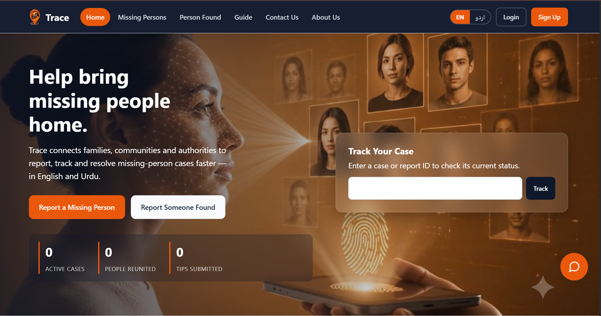
  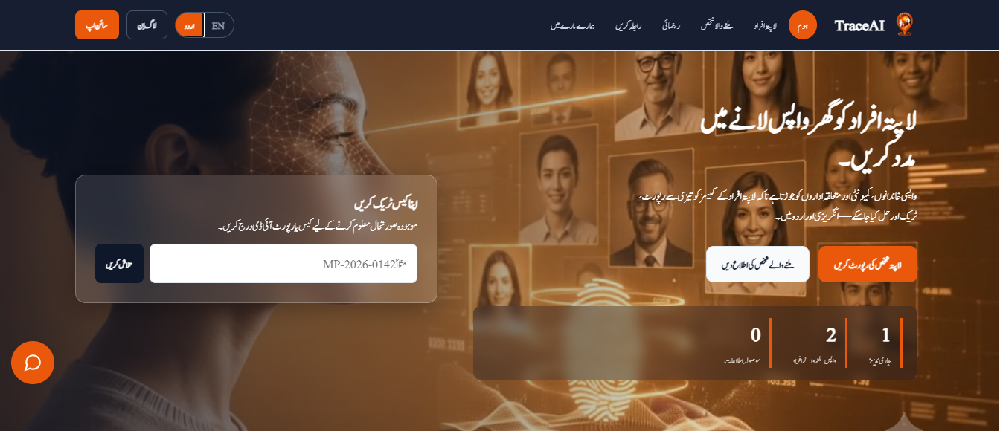
  
  Page 2: Missing Person
   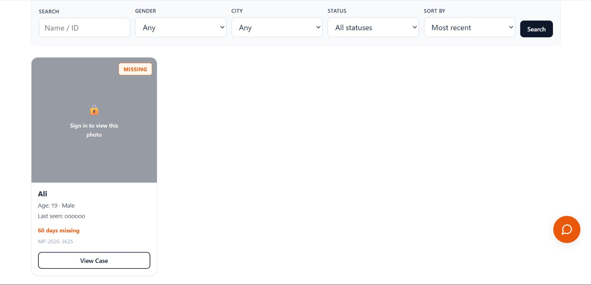

  Page 3: Person Found
     

  Page 4: Guide
    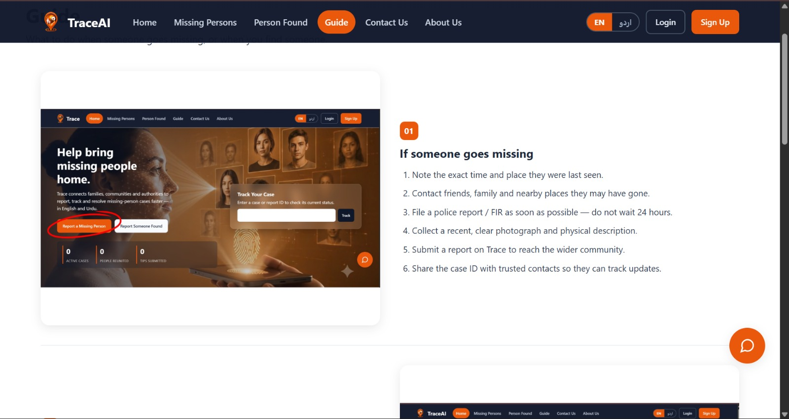

  Page 5: Contact Us
    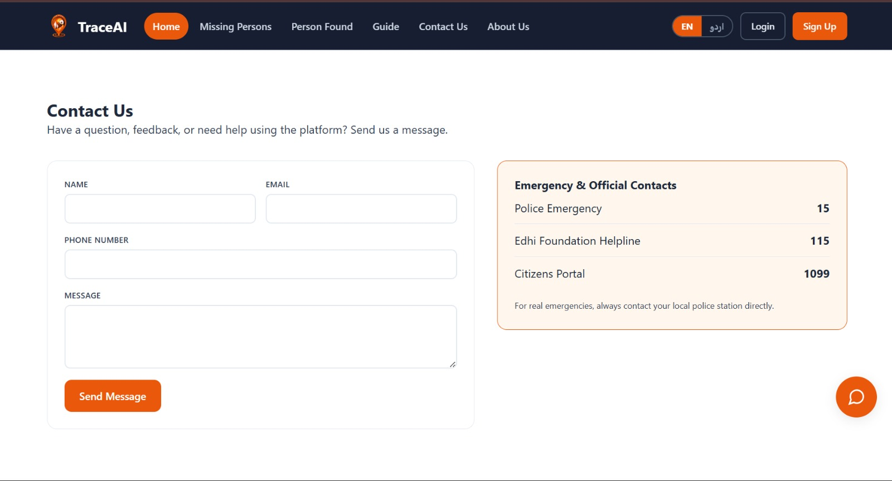

  Page 6: About Us
   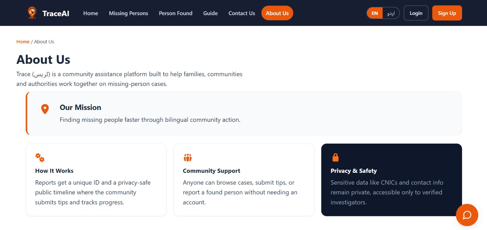

  Page 7: Sign Up
   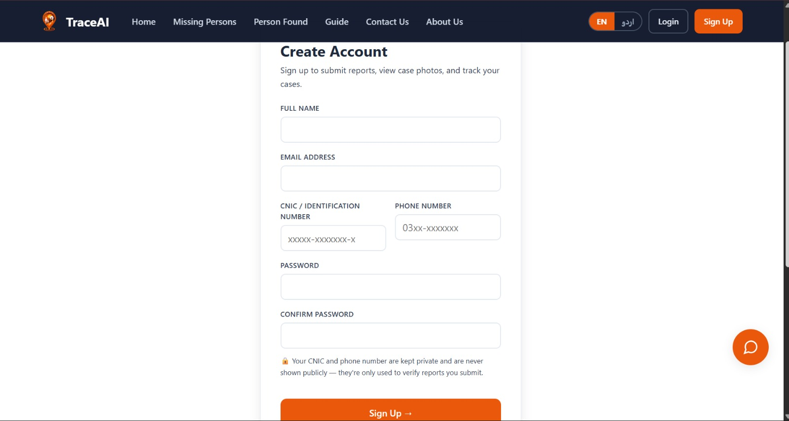

  Page 8: Login
   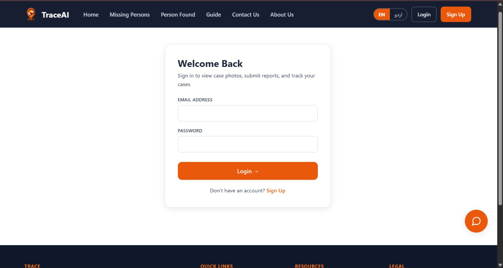

  Page 9: Chat Bot
   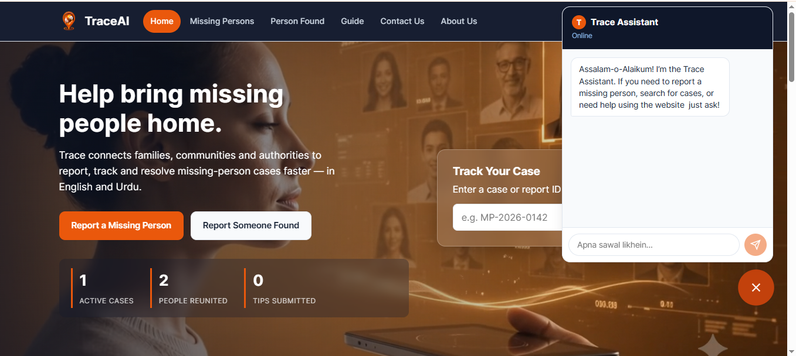

  Page 10: Admin Dashboard
   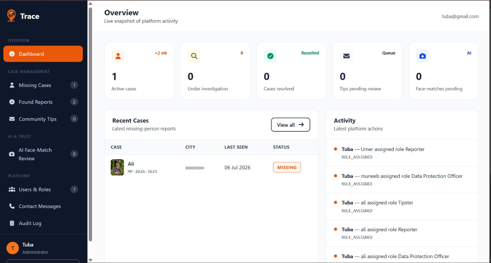

  Page 11: Community Tips
   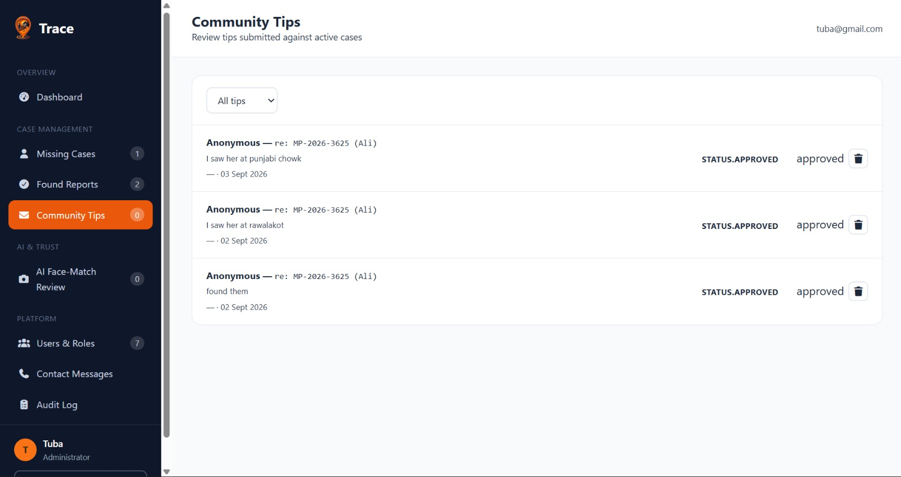

  Page 12: AI Face Match
   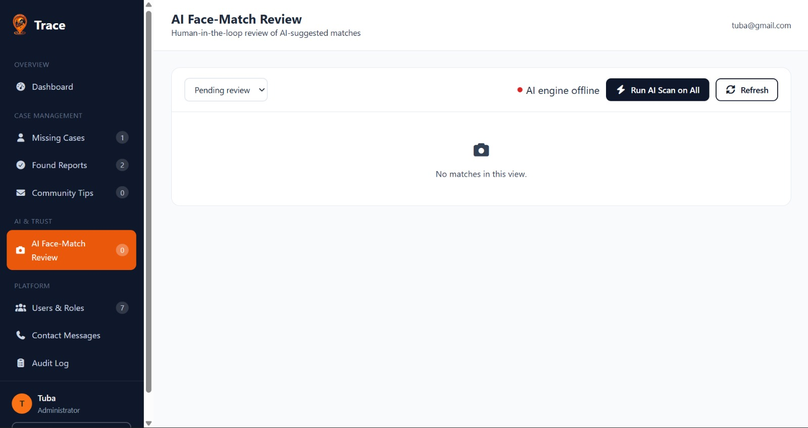

  Page 13: User & Roles
   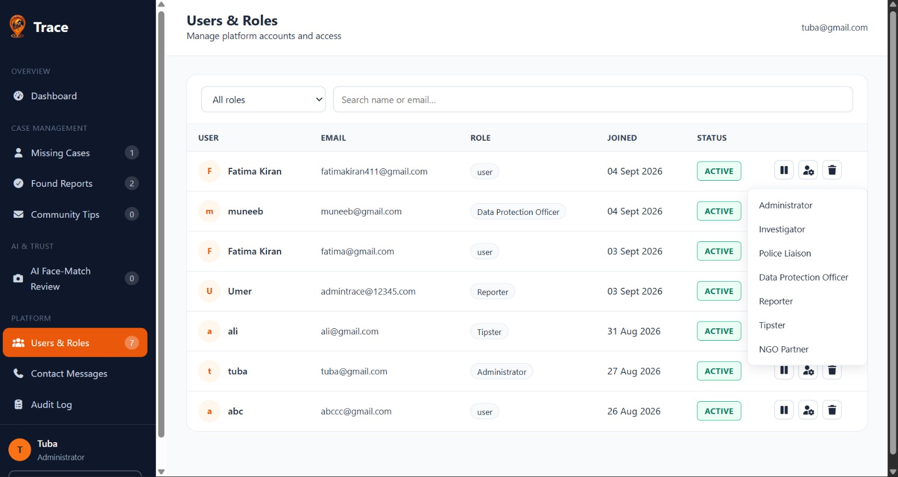

## Structure

```
frontend/
  src/
    resources/         colors.js, colorStrings.js, dimensions.js
    i18n/               translations.js, LanguageContext.jsx
    context/            AuthContext.jsx, DataContext.jsx
    api/                faceMatchApi, tipsApi, usersApi, auditApi, ...
    components/         Navbar, Footer, CaseCard, FoundPersonCard, BlurGate,
                        StatusBadge, RequireAuth, RequireAdmin, SplashScreen,ChatWidget
    components/admin/   CaseDetailModal, FoundDetailModal, MatchCard, Toast
    pages/              Home, MissingPersonsList, MissingPersonDetail,
                        PersonFound, PersonFoundDetail, ReportMissing,
                        ReportFound, Login, Signup, Dashboard, Guide, About,
                        Contact, NotFound
    pages/admin/        AdminDashboard

backend/
  routes/               authRoutes, personRoutes, reportRoutes, tipRoutes,
                        faceMatchRoutes, auditRoutes,Chat Widget
  controllers/          matching controllers for each route
  models/               User, MissingPerson, Report, Tip, FaceMatch, AuditLog
  services/             faceMatchService.js (talks to the Python face engine)
  middleware/           authMiddleware.js, upload.js

face_dtc/               standalone Python/FastAPI face verification service
  app.py, face_engine.py, db_manager.py
```

## Running it locally

### 1. Frontend

```bash
cd frontend
npm install
npm run dev
### 2. Backend

```bash
cd backend
npm install
node server.js
### 3.AI Face Detection / Verification
cd "face dtc"
venv\scripts\activate
python app.py

Then add a `.env` file in the root with your own Groq API key, MongoDB URI, JWT secret, and FACE_ENGINE_URL for face detection. 
